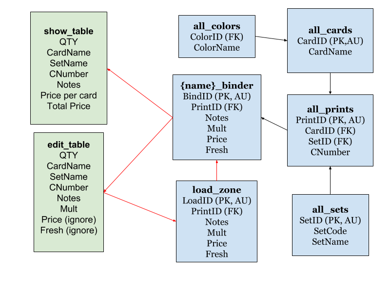

# Magic the Gathering Database and Collection Manager

## At a Glance Status:
10 April 2018
I have recently finished the autocomplete features when entering in cards. 
I added a toggle feature as the autocomplete for card name was incredibly slow.
The new goal is to restructure the app program as to let other people interact with it without hard-coding my sensitive
information like passwords and IP address into the app. I may seek a web service to provide me another mySQL server to work with.
In general, the first prototype is finished as I planned it out.

## Q: What is this project about?
A: My goal is to create an app/dashboard that I can use to track and manage mine and my roommate's personal
Magic the Gathering collection. The data is stored in a mySQL server, and the dashboard app is made using RShiny.

## Q: What is Magic the Gathering?  
A: Magic the Gathering is a trading card game developed by Wizards of the Coast and owned by Hasbro. 
It's the most popular TCG in the country and has competitive tournaments all across the world. 
The recent 2017 World Championship boasted a first prize of $100,000. I play this game fairly competitively as well, 
and spend a fair amount of my time playing, theorycrafting, or otherwise interacting with Magic. 
As it is a successful TCG, many of its cards have significant value and even have their own seconday market, 
with single prices of cards reaching tens of thousands of dollars. 
Most repeat players have some sort of trading binder with cards displayed for trading, 
but the actual price of these cards varies depending on the market. 

## Q: Why make your own app when there are plenty available with more features?
A: I have plenty of reasons. In no particular order:
* This is fun for me. I enjoy data management and coding in R and have been looking for a good project as an excuse to get used to RShiny.
* Making my own app gives me more freedom with implementing features like autocompletion and inputing cards as tables.
* I wanted a solid SQL project for my portfolio

## Q: So overall how does this work?
A: The app as coded above interacts with a mySQL server database. 
The app has a series of buttons and tables that allow the user to make changes to the database with transactions.
These transactions are funcitons in R that create a query in SQL that implements the change to the database.
Ideally, The database can be maintained and edited by the user with __only__ the RShiny App.

## Q: How do you run the app?
A: Currently, the app is only able to be run on my laptop for mySQL permissions sake. The function dashboard() opens the app. 
It sources my: 
* init_script.R file which loads the below R scripts, various dataframes and environment information that is used in the app, etc.
* transaction_functions.R file which holds my r code for interacitng with SQL directly
* app_functions.R file which holds the nitty-gritty code for the app in question, as well as some useful constants.
* config.R which holds my username, password, database name, and IP_address of the server (NOT INCLUDED IN GITHUB FOR SECURITY PURPOSES)

## Q: What does your app look like?
A: Its not pretty at the moment, since I'm mostly concerned on it working. 

## Q: What can you do with the app?
A: Currently:
* Add cards to the Input table and add all of them to the desired binder. You may toggle autocompletion for card name and set name.
* Look up all sets that contain a card with a specified name.
* Clear the table all at once.
* Go into "edit mode" by selecting a binder, editing certain fields of the data table, and then committing those changes. 
if the input table is accidentally deleted, the changes are not committed.
* View the current quantities of cards in each binder
* Empty all cards in a given binder (soon to be discontinued)
* Update card prices

## Q: What is your database Schema?
A: Binders are their own tables where individual cards are stored (importantly not quantity like the app would suggest).  
There is a "loadzone" where card information is temporarily stored before being loaded into a binder. While this is in 
general more tables than necessary, it aids significantly in debugging and results in simpler SQL queries in the long run.
Card existence information is divvied up into 3 lookup tables: all_cards, all_sets, and all_prints. All cards labels every single card name used in magic the gathering. all_sets labels every set used in magic the gathering, as well as its set code. All prints refers to every card printed in magic (some card names have many different printings with different prices) as well as their collectors number (important for looking up prices).

## Q: What do you plan on implementing in the future?
A: Quite a lot:
* Getting a version of the App accessible to the web for demonstration purposes.
* Creating a "Binder View" app that cleanly displays images of the cards as well as their prices as if it were a physical binder of cards.
* Creating a "Cost to Complete" app that determines the cards as well as their price that are required to finish a deck based
on what cards are available in play and trade binders.
* Creating a "Trade Table" app that keeps track of prices of desired cards in both sides of a trade.

## Q: I like your work! How can I contact you for professional stuff?
A: Thank you so much! My business email is LEHMKUDC@gmail.com. I am currently seeking full-time employment in a large metro area either as a long-term employee or as an Intern. I am always happy to have a chat with other folks who enjoy this type of thing even if it's not
directly discussing employment.

Thank you for taking the time to check out my work as well as my casual readme about it!
